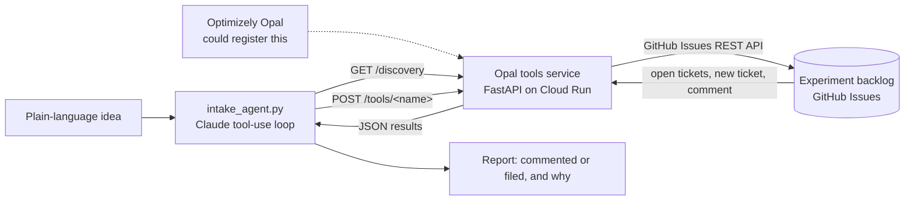

# Experiment Intake Agent

An agent that takes a raw experiment idea in plain language and gets it into the team's backlog without creating a duplicate. It checks what is already open, then either adds the new angle to an existing ticket or files a properly structured experiment brief.

## Why it exists

Optimizely's agent platform is good at generating experiment ideas. Ideas are cheap now, so backlogs fill with near-duplicates, and the step between "Opal suggested a test" and "it is in the sprint with a hypothesis and a primary metric" is manual work that nobody owns.

Every agent in Optimizely's own directory works on Optimizely's own data. Custom tools are how their Agent Platform reaches systems Optimizely does not own. This project connects it to the backlog, which here is GitHub Issues.

## How it maps to Optimizely's architecture



- **Three tools on one Opal tools service**, built with Optimizely's Opal Tools SDK: `list_experiment_backlog`, `create_experiment_ticket` and `comment_on_experiment`.
- **A discovery endpoint.** `GET /discovery` returns the tool menu (names, descriptions, parameters, and the endpoint for each). Opal reads it to learn what the service can do. Each tool is called at `POST /tools/<tool_name>` with its arguments inside a `"parameters"` object.
- **My own agent loop** (`intake_agent.py`) reads that same discovery document and calls the tools over HTTP, exactly as Opal would.

The agent is given a goal, not a script. After reading the backlog it decides whether the idea overlaps an existing ticket. That decision picks the branch: comment and stop, or structure a brief and file it. If the idea is missing a target page, metric or rationale, the agent infers one and the ticket says so in a visible note. An iteration cap stops the loop if it ever fails to finish.

Live discovery endpoint: https://experiment-intake-tools-555914170238.us-central1.run.app/discovery

Demo backlog: https://github.com/corduroyfields/experiment-backlog/issues

## Why it is not registered in Opal

Registering a custom tool needs an Optimizely org with the Agent Platform provisioned by a CSM, and there is no self-serve path. So I built the service to the public tools spec using Optimizely's own SDK, deployed it where Opal could reach it, and drove it with my own agent loop to show the workflow end to end.

## Run it

Needs [uv](https://docs.astral.sh/uv/) and a `.env` file with `ANTHROPIC_API_KEY`, `GITHUB_TOKEN` (a fine-grained token scoped to one repo, Issues read and write only) and `GITHUB_REPO` (`owner/repo`).

```bash
uv run python main.py
```

```bash
uv run python intake_agent.py "Let's try a free shipping progress bar in the cart drawer"
```

Set `TOOLS_URL` to point the agent at the deployed service instead of localhost.

## A note on how this was built

I built this with Claude Code as a programming assistant. I wrote the product spec, made the scope and design decisions, and tested both branches against a real backlog. Claude wrote most of the code, and I reviewed it with its help. I say this openly because working well with AI tooling is part of the skill set I am building, and I would rather be straightforward about my process. I am not a developer by trade.
