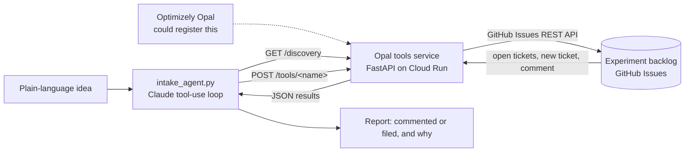

# Experiment Intake Agent

An AI agent that turns a raw experiment idea into a properly structured backlog ticket, and refuses to file duplicates. You give it one sentence. It reads the existing backlog, decides whether the idea is already covered, and then either adds the new angle to the existing ticket or files a new experiment brief with a hypothesis and a primary metric.

## Summary

- **The problem.** Optimizely Opal makes experiment ideas cheap to generate. The step after that, getting an idea into the backlog as a well-formed test without duplicating one that is already there, is still manual and unowned.
- **What I built.** A tools service built with Optimizely's own Opal Tools SDK, so it follows the same contract Opal uses to call custom tools. It is deployed live on Google Cloud. I also built an agent that drives those tools end to end, because registering a tool inside Opal requires a provisioned customer org.
- **The outcome.** Given a duplicate idea, the agent comments on the existing ticket and files nothing new. Given a novel idea, it files a structured brief and flags any detail it had to infer. Both results are live in a public backlog you can click through below.

## See the outcome in two minutes

No setup needed. Everything below is a link.

1. **A ticket the agent filed from one sentence.** [Ticket #8](https://github.com/corduroyfields/experiment-backlog/issues/8) came from the input *"Let's try a free shipping progress bar in the cart drawer."* The agent wrote the hypothesis, chose a primary metric, and put a note at the top saying which fields it inferred so a human can confirm them.
2. **A duplicate the agent caught.** The input *"What if the add to cart button followed them down the page?"* never uses the word "sticky", but the agent matched it to [ticket #1](https://github.com/corduroyfields/experiment-backlog/issues/1), "Sticky add-to-cart bar". Instead of filing a duplicate, it [added a comment](https://github.com/corduroyfields/experiment-backlog/issues/1#issuecomment-5734937322) with the one new idea the input contributed.
3. **The agent's reasoning, step by step.** The [duplicate run](docs/run-duplicate.txt) and the [novel run](docs/run-novel.txt) are saved exactly as they printed. Each one shows the tools the agent called and why it chose that path.
4. **The contract Opal would read.** The [live discovery endpoint](https://experiment-intake-tools-555914170238.us-central1.run.app/discovery) lists each of the three tools with its parameters and URL. It is plain JSON and opens in any browser.
5. **The decision point in the code.** [intake_agent.py, line 86](intake_agent.py#L86). There is no "if duplicate" rule. The agent picks its next action after reading the backlog, which is what makes it an agent rather than a script.

The [backlog itself](https://github.com/corduroyfields/experiment-backlog/issues) holds four seeded tickets (#1 to #4) plus #8, which the agent filed. Closed tickets #5 to #7 are from rehearsal runs.

## Why it exists

Optimizely's agent platform is good at generating experiment ideas. Ideas are cheap now, so backlogs fill with near-duplicates, and the step between "Opal suggested a test" and "it is in the sprint with a hypothesis and a primary metric" is manual work that nobody owns.

Every agent in Optimizely's own directory works on Optimizely's own data. Custom tools are how the Agent Platform reaches systems Optimizely does not own, such as a team's backlog. This project connects it to one, which here is GitHub Issues. The same pattern would work for Jira or Azure DevOps.

## How it works



1. The agent reads the service's discovery endpoint to learn which tools exist. Opal does the same when a tool is registered.
2. It calls `list_experiment_backlog` to see every open ticket.
3. It decides whether the new idea overlaps one of them.
4. If it overlaps, it calls `comment_on_experiment` on that ticket and stops.
5. If it is new, it structures a brief and calls `create_experiment_ticket`. Any missing detail it infers is listed on the ticket, never filled in silently.
6. It reports what it did and why.

The number of steps changes with the input, because the agent chooses the path. A limit of 8 rounds stops the loop if it ever fails to finish.

**Technical details.** The three tools are registered with the Opal Tools SDK's `@tool` decorator. `GET /discovery` returns the tool menu, and each tool is called at `POST /tools/<tool_name>` with its arguments inside a `"parameters"` object. The agent calls the tools over HTTP rather than importing them, which proves they work as real services for any caller. The GitHub token is scoped to one repo with Issues access only.

## Why it is not registered in Opal

Registering a custom tool needs an Optimizely org with the Agent Platform provisioned by a CSM, and there is no self-serve path. So I built the service to the public tools spec using Optimizely's own SDK, deployed it where Opal could reach it, and drove it with my own agent loop to show the workflow end to end.

## Run it yourself

This is optional. It needs [uv](https://docs.astral.sh/uv/) and a `.env` file with `ANTHROPIC_API_KEY`, `GITHUB_TOKEN` (a fine-grained token scoped to one repo, Issues read and write only) and `GITHUB_REPO` (`owner/repo`).

```bash
uv run python main.py
```

```bash
uv run python intake_agent.py "Let's try a free shipping progress bar in the cart drawer"
```

Set `TOOLS_URL` to point the agent at the deployed service instead of localhost.

## A note on how this was built

I built this with Claude Code as a programming assistant. I wrote the product spec, made the scope and design decisions, and tested both branches against a real backlog. Claude wrote most of the code, and I reviewed it with its help. I say this openly because working well with AI tooling is part of the skill set I am building, and I would rather be straightforward about my process. I am not a developer by trade.
